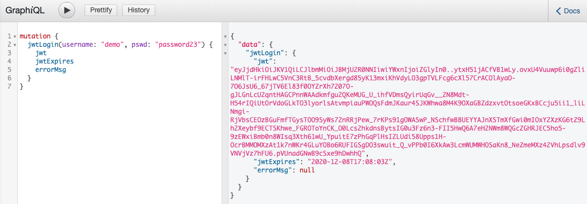
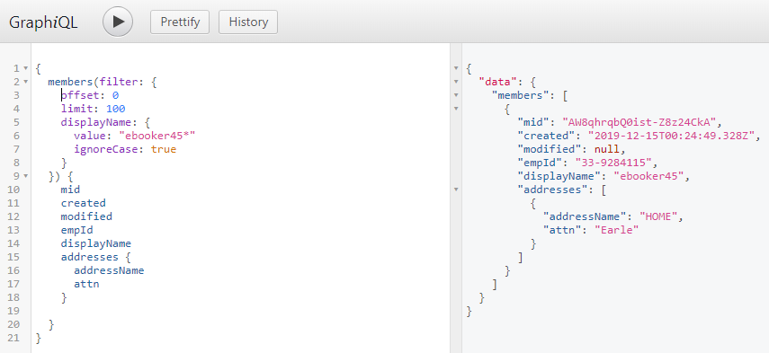

# mcorpus

A robust GraphQL server endpoint POC written in Java 8.

A Maven-based Java project with two sub-projects:

- **mcorpus-gql**
  The MCorpus GraphQL server endpoint packaged as an über jar.
- **mcorpus-db**
  Houses the jOOQ generated types representing the db-schema and data access api in the form of Java classes. Used by mcorpus-gql.

## docs

Checkout the [wiki](https://github.com/khanactl/mcorpus/wiki) pages for design details..

## Features

- GraphQL-based user login by username and password.
- JWT (signed and encrypted) via graphql mutation method.  A short-lived JWT is returned as a string in the graphql resppnse and a long-lived jwt refresh token is returned as a secure, http-only cookie upon successful user login.
- Per-request sync token verification via secure http-only cookie and http header for all inbound GraphQL requests to mitigate CSRF attacks.
- GraphiQL - the 'schema discovery' UI intended for developers to introspect the schema and issue GraphQL requests from a web UI.
- Lean and performant Java 8 code in a fully asynchronous paradigm realized by best-of-breed stack:
  - [Postgres](https://www.postgresql.org/)
  - [jOOQ](https://www.jooq.org/)
  - [graphql-java](https://github.com/graphql-java/graphql-java)
  - [Ratpack](https://ratpack.io/) / [Netty](https://netty.io/)

## AWS

mcorpus is maintained in [AWS](https://mcorpusgql-dev.net).

- All mcorpus data was generated purely randomly and is completely fictitous meant only for demonstrating a Java/Netty based, fully asynchronous, highly performant GraphQL endpoint.
